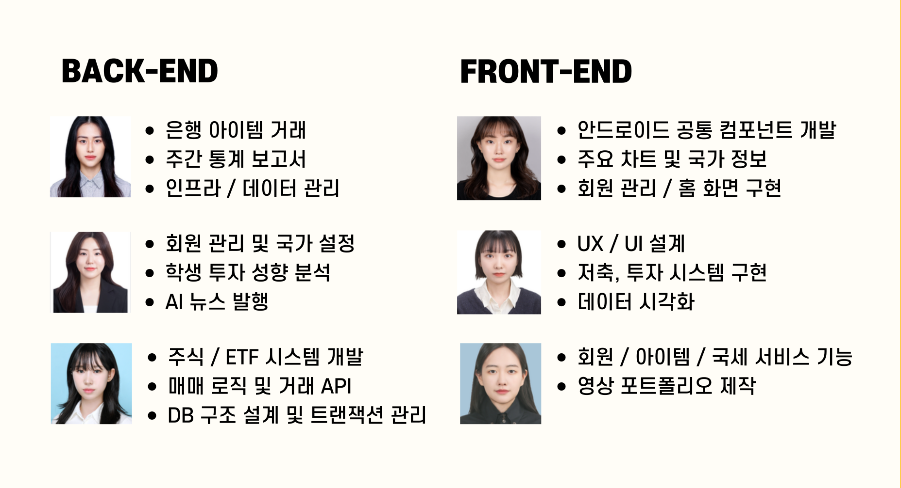

# 💰 땡그랑 (초등 경제 교육 서비스)

### 👆 위 이미지 클릭하면 `앱 소개 영상` 감상 가능합니다 👆

 

# 목차

1. [**개요**](#✨-개요)
1. [**주요 기능**](#-주요-기능)
1. [**서비스 화면 (교사 / 학생)**](#-땡그랑-서비스-화면-교사)
1. [**기술 스택**](#-기술-스택)
1. [**프로젝트 진행 및 산출물**](#-프로젝트-진행-및-산출물)
1. [**개발 멤버 및 회고**](#-개발-멤버-및-역할분담)
1. [**메뉴얼 및 상세문서**](#-메뉴얼-및-상세-문서)

 

# ✨ 개요

#### 서비스명 : 땡그랑 ( 똑똑한 경제 학습 )

#### 한줄 설명 : `디지털 교과서 전환에 맞춘, 테블릿 활용 초등 경제 학습 서비스`

#### 프로젝트 기간 : 2025.01.06 ~ 2025.02.21

 

# ✨ 주요 기능

-   서비스 설명 :
-   주요 기능 :
    -   기능1
    -   기능2
    -   기능3
    -   기능4

 

# 👩‍🏫 땡그랑 서비스 화면 (교사)

# 👧 땡그랑 서비스 화면 (학생)

 

# 📚 기술 스택

### Backend & Ai

 
  
   
  
  
  
  
  
  
  
  

  
  
  

### FrontEnd

 
  
  
  
  
  
  
  
  
  

### Infra

 
  
  
  
  
  
  

### Project Management & DevOps

 
  
  
  
  
  
 

## 기술적 특징

### K-Means Clustering 모델 활용

-   비 지도 학습 -> 지도학습 순서로 진행
-   비 지도 학습을 통해 비슷한 유형끼리 군집화하여 소비 유형 분류 (소비형, 저축형, 투자형)
-   지도학습을 추가로 진행하여 예측 데이터를 제공하고, 분류가 얼마나 잘 이루어지는지 테스트 98.89% 정확도 결과.

### Open Ai 프롬프팅 전략

-   설명

## 서비스 아키텍처

 

# ✨ 프로젝트 진행 및 산출물

## 화면 설계서

-   피그마 정리해서 캡쳐

## API 명세서

-   노션 정리해서 캡쳐

## ERD

## Git

-   아래는 Sourcetree에서 확인한 브랜치 내역입니다.

 

# 👨‍👩‍👧‍👦 개발 멤버 및 역할분담

|                                                          **[정유진](https://github.com/breadbirds)**                                                          |                                                          **[박진현](https://github.com/iamjinhyeon)**                                                          |                                                           **[서미지](https://github.com/itsanisland)**                                                            |                                                          **[이사랑](https://github.com/frame5562)**                                                           |                                                          **[임정인](https://github.com/harperim)**                                                          |                                                          **[최연지](https://github.com/yeonji3038)**                                                          |
| :-----------------------------------------------------------------------------------------------------------------------------------------------------------: | :-----------------------------------------------------------------------------------------------------------------------------------------------------------: | :-----------------------------------------------------------------------------------------------------------------------------------------------------------: | :-----------------------------------------------------------------------------------------------------------------------------------------------------------: | :-----------------------------------------------------------------------------------------------------------------------------------------------------------: | :-----------------------------------------------------------------------------------------------------------------------------------------------------------: |
|  |  |  |  |  |  |
|                                                                       Leader & Frontend                                                                       |                                                                           Frontend                                                                            |                                                                        Backend & Infra                                                                        |                                                                           Frontend                                                                            |                                                                            Backend                                                                            |                                                                            Backend                                                                            |

 

# 📒 메뉴얼 및 상세 문서

-   [포팅메뉴얼](https://lab.ssafy.com/s12-webmobile4-sub1/S12P11D107/-/wikis/%ED%8F%AC%ED%8C%85-%EB%A9%94%EB%89%B4%EC%96%BC)
-   [Git](https://lab.ssafy.com/s12-webmobile4-sub1/S12P11D107/-/wikis/Git)
-   [화면 설계서](https://www.figma.com/design/16E9xxHkVz0Iray1mDCXxy/%EB%95%A1%EA%B7%B8%EB%9E%91-%F0%9F%92%B0?node-id=629-18478&p=f&t=FvhdWhJP0l99fRVd-0)
-   [ERD](https://www.erdcloud.com/d/feQGbFmFS8WJpQPAg)
-   [API 명세서](https://www.notion.so/1a5e605dad4d813ca426d0b46c18993e?v=1a5e605dad4d81deafdc000c5e0ee43e)
